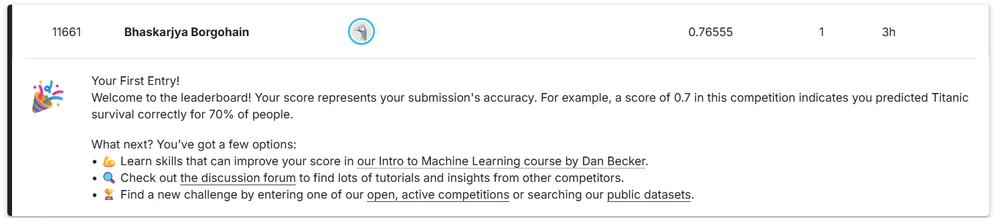

# Titanic - Machine Learning with Logistic Regression 🚢

## 🎯 Project Goal
Predict passenger survival on the Titanic using Logistic Regression.

## 📁 Files
- `titanic_logistic_regression.ipynb`: Main notebook with preprocessing and model
- `submission.csv`: Output file submitted to Kaggle

## 📈 Accuracy
- Kaggle leaderboard score: **0.76555**
- Validation accuracy: ~76%

## 🛠️ Technologies Used
- Python, Pandas, NumPy
- Scikit-learn
- Google Colab
- Kaggle Titanic dataset

## 🧠 Learnings
- End-to-end ML pipeline
- Data cleaning and encoding
- Model training and validation
- Submission workflow on Kaggle

## 📤 Submission
Submitted to: [Kaggle Titanic Challenge](https://www.kaggle.com/competitions/titanic)

## 🏆 Kaggle Submission Result

I successfully submitted my predictions and entered the leaderboard!  
**Entry Name:** Bhaskarjya Borgohain  
**Position:** #11671  
**Score:** 0.76555

### 📸 Screenshot:

  
*My first entry on the Titanic leaderboard!*

---
